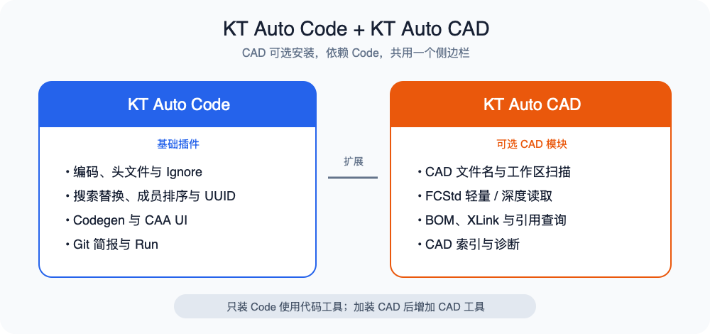

# KT Auto Code

面向 **CAA / MSVC C++** 的开发效率工具：核心在 `src/`，通过 **CLI** 或 **VS Code / Cursor 插件** 使用。本仓库只产出基础插件 `KT Auto Code`；可选 CAD 能力由并列仓库 `kt-auto-cad` 独立构建和发布，安装后仍接入同一个 Activity Bar、Ribbon 与 Block 容器。

源码仓库：[Gitee](https://gitee.com/phoenixwing/kt-auto-code) · [GitHub](https://github.com/phoenixwing-org/kt-auto-code)。

需要同时配置两个远端时，macOS/Linux 运行 `./addRemote.sh`，PowerShell 运行 `.\addRemote.ps1`。脚本可重复执行且默认保留已有 `origin`；仅显式使用 `--remove-origin` 或 `-RemoveOrigin` 时才删除它。

当前插件提供 **头文件编码修正、文件转码、Ignore 设置、工作区搜索替换、C++ 成员排序、UUID 替换、CAA UI、工程环境管理与 Codegen 参数表原型**。成员排序、UUID、CAA 扫描和 Codegen 预检可共用 `.phoenix/worksets.json`；搜索替换当前使用独立目录选择，工作集入口待产品交互明确后再评估。工程环境 Block 直接维护操作系统用户环境变量，不使用 VS Code Settings 伪装系统值；其他插件配置仍使用 VS Code Settings。写盘前会检查冲突和文件快照，结果统一显示在单 Block 中；Codegen Apply 会自动预检、重验源码指纹并保持 UTF-8/BOM/GBK 原编码，批量写入失败时尝试回滚。

## Code 与 CAD 功能关系



## 快速开始

```bash
pnpm install

# 完整联调：要求 ../phoenix-wing 与 ../kt-auto-cad
pnpm dev

# npm Registry 精确版本对照
pnpm dev:registry

pnpm test
pnpm ext:typecheck
pnpm ext:build
pnpm scan-encoding --headers --ascii tests/fixtures/multiChar   # 预检
pnpm fix-headers tests/fixtures/multiChar                         # 修复（慎用）
```

**基础插件**：`pnpm ext:watch` → 本仓库 **F5** → Host 窗口打开 CAA 工程 → Side Bar **KT Auto Code**。

开发环境使用 Node.js 22 LTS 与 pnpm 10。`pnpm dev` 是默认跨仓双插件联调入口，强制消费并列本地 Wing，并分别在 Auto 与 CAD 所属仓库构建扩展；`pnpm ext:dev:code` 只构建基础插件。完成来源门禁后，启动器把两个仓库的扩展复制到独立临时快照并启动全新 Host 窗口。正式 Auto Registry 对照与发布不要求 CAD 仓库存在，使用 `pnpm dev:registry` 或 `pnpm ext:release-candidate`。详见[本地 Wing 并列开发](docs/本地Wing并列开发.md)、[可选模块接入契约](docs/可选模块接入契约.md)与 [KT Auto CAD 仓库](https://gitee.com/PhoenixWing321/kt-auto-cad)。

## 发布

正式 VSIX 建议从 `../.worktrees/kt-auto-code-release` 的 detached worktree 构建，切到明确 tag 或 commit 后执行 `pnpm install --frozen-lockfile && pnpm verify:ci`；不要把 `pnpm dev` 的本地 Wing 联调产物用于发布。Auto 的完整 worktree 更新、制品位置、人工安装与 Marketplace 点检见[VS Code 插件发布](docs/VS%20Code%20插件发布.md)；CAD 发布由 [KT Auto CAD 仓库](https://gitee.com/PhoenixWing321/kt-auto-cad)独立维护。

## 文档

| 文档 | 内容 |
| --- | --- |
| [docs/README.md](docs/README.md) | 文档索引 |
| [当前路线](docs/current-roadmap.md) | 当前优先级、完成基线与 92.5 联合治理接入责任 |
| [Phoenix 三形态产品架构计划](docs/Phoenix三形态产品架构计划.md) | VS Code 双插件、Tauri/Web、共享 core 与统一发布总纲 |
| [项目调查](docs/项目调查.md) | 项目定位、实际实现、架构、当前状态与行为边界 |
| [PNXCaaStudy CAA 命名规则调查](docs/PNXCaaStudy-CAA命名规则调查.md) | I/E、TIE、dico 命名证据与完整名称/末词段两种模式 |
| [工作区验收记录](docs/真实工作区只读验收.md) | CAA、C++、Web 只读预览与一次性工作区真实写盘验收 |
| [代码规范](docs/代码规范.md) | 命名前缀、代码整理、MVC、状态与测试规则 |
| [UI 开发规则](docs/前端开发规则.md) | Ribbon、单显示多打开、Block 布局、范围、缓存、结果、Diff、主题与验收的权威规范 |
| [Codegen 快速原型](docs/Codegen快速原型.md) | Codegen 单 Block、多 JSON View、共享 Table 与 MVC 边界 |
| [Codegen 总 Controller 会话提炼点检](docs/codegen-plan/Codegen总Controller会话提炼点检表.md) | Session Controller、VS Code Host adapter 责任图与后续拆分边界 |
| [Codegen 手工验收](docs/codegen-plan/Codegen手工验收.md) | 可重置 fixture 工作区、深浅主题与冲突/取消测试步骤 |
| [搜索替换](docs/搜索替换.md) | 文本/文件名/文件夹名替换、字节精确处理与安全边界 |
| [源文件编码扫描](docs/源文件编码扫描.md) | CLI、扫描范围；**CP1252 / 全角标点映射表** |
| [编码修正](docs/编码修正.md) | 整文件编码检测与转换（`encodingFix`） |
| [开发与测试](docs/开发与测试.md) | F5、测试、选项与检查清单 |
| [本地 Wing 并列开发](docs/本地Wing并列开发.md) | `pnpm dev` 本地双插件联调、AI 构建与 Registry 对照门禁 |
| [VS Code 插件发布](docs/VS%20Code%20插件发布.md) | Marketplace 发布流程、上架检查清单与版权说明 |

## 常用命令

| 命令 | 说明 |
| --- | --- |
| `pnpm dev` / `pnpm ext:dev` | 构建并列 `../phoenix-wing`、`../kt-auto-cad`，联调 Code + CAD |
| `pnpm ext:dev:prepare` | 使用本地 Wing 构建双插件并验证来源，不启动 GUI |
| `pnpm ext:dev:code` | 只构建并启动 Auto Code + 本地 Wing |
| `pnpm ext:dev:code:prepare` | 只构建 Auto Code + 本地 Wing 并验证来源，不启动 GUI |
| `pnpm dev:registry` | 清除本地模式并用 Registry 精确版本构建、启动 Auto Code |
| `pnpm ext:dev:registry:prepare` | 使用 Registry 精确版本构建 Auto Code，不启动 GUI |
| `pnpm ext:watch` | 监听编译扩展 |
| `pnpm ext:launch` | 同时加载 Code + CAD 的 Extension Host（默认 F5 配置） |
| `pnpm ext:launch:code` | 只加载 KT Auto Code 的 Extension Host |
| `pnpm ext:launch:codegen` | 构建插件、复制新 Codegen QA fixture 并启动 Extension Host |
| `pnpm ext:test:host` | 在独立配置中启动真实 VS Code，自动验收 Codegen 代表宿主流程 |
| `pnpm ext:test:host:cad` | 加载并列 Auto + CAD，自动验收扩展发现、Shell API v2 和 CAD 命令注册 |
| `pnpm ext:prepare:codegen` | 只准备新的临时 Codegen QA 工作区 |
| `pnpm ext:verify:codegen -- <路径> [--checkpoint-a|--checkpoint-e]` | 验证 fixture 基线、CSV 或真实 Apply 结果 |
| `pnpm ext:report:codegen -- <路径>` | 查看或记录 A–F 手工验收进度 |
| `pnpm fix-headers` | 头文件纯 ASCII 修复 |
| `pnpm scan-file-encoding` | 整文件编码预检（GBK / BOM / UTF-16） |
| `pnpm convert-file-encoding` | 转换为 UTF-8 |
| `pnpm scan-encoding --headers --ascii` | 头文件预检（含 GBK / BOM） |

## 仓库结构

```text
package.json          # 扩展 manifest、版本与开发/验证/发布入口
src/                  # Extension Host、Webview 与工具适配
src/core/             # Auto 专属 Host-neutral 模型、工作流和算法（无 vscode 依赖）
media/                # Marketplace、Activity Bar 与工具图标
resources/            # 随 VSIX 发布的只读 runner
scripts/              # CLI + 开发、构建、测试、打包与发布门禁
tests/fixtures/       # 核心、CLI 与 Extension Host 代表夹具
tests/webview/        # 浏览器/Webview 结构夹具
docs/                  # 当前中文文档、专项计划与历史归档
dist/                 # 扩展运行 bundle（Git ignored）
dist/vsix/            # Git ignored 的 VSIX 与 SHA-256
```

仓库根现在就是唯一的 VS Code 扩展包根，不再保留只有一个成员的 `extension/` workspace。原 Host-neutral 逻辑集中在 `src/core/`，继续由架构门禁限制其不得依赖 `vscode`；实施记录见[仓库结构与扁平化迁移计划](docs/仓库结构与扁平化迁移计划.md)。KT Auto CAD 已是同样的根包结构，但因规模较小无需照搬 Auto 的全部内部分层。

## 版权、技术来源与许可证

KT Auto Code 由上海锟钛开发，面向 CAA / MSVC C++ 工作流提供编码治理、Ignore 配置和工作区搜索替换能力。

名称替换与关联替换算法源自上海锟钛于 2024 年开发的 Windows 应用程序（采用 C++、Qt 与 .NET 技术），并针对 VS Code 插件场景进行了重新设计和实现。

- 软件著作权登记号：`2024SR1374380`
- Copyright © 2024–2026 上海锟钛。
- 本项目使用 [Apache License 2.0](LICENSE) 开源。

完整的中英文版权声明及 Marketplace 发布信息见 [VS Code 插件发布文档](docs/VS%20Code%20插件发布.md)。
