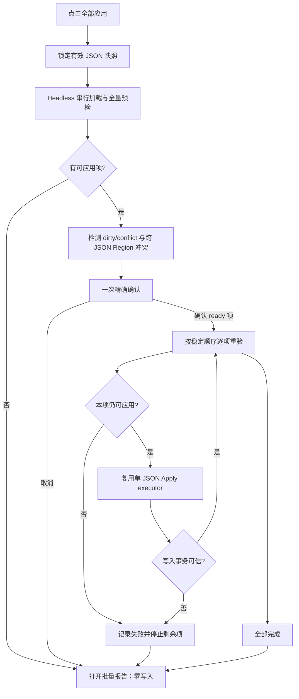

# Codegen 全部应用 2.0 与批量报告计划

状态：future（2.0）

Owner：KT Auto Code maintainers

适用版本：0.5.x 后续迭代

建立日期：2026-07-18

本文是“全部应用 2.0”安全编排与完整批量报告的未来设计真源。当前已落地的简版 V1 行为与证据见 [`Codegen全部应用点检表.md`](Codegen全部应用点检表.md)：V1 已把 single/batch 报告写入 `.phoenix/reports/codegen/`，通过 Primary 列表重开并在动态 View 中按 JSON 筛选、打开 Codegen View 和定位问题；它也已区分正常/警告/错误与已更新/内容一致/部分更新/未应用，并让批量任务在后台 session 中运行而不铺开 Panel。实现细节见 [`Codegen应用报告与View生命周期改进计划.md`](Codegen应用报告与View生命周期改进计划.md)。V1 仍没有跨 JSON 冲突、取消、独立 Problems 和完整 receipt/唯一文件统计，不得冒充 2.0 完整批次报告。

## 1. 目标与范围

在 Primary 的工作区 / JSON 列表 Block 增加文字按钮 `全部应用`，一次处理点击时已发现的有效 Codegen JSON：

1. 固定候选快照并逐份预检；
2. 在第一次写盘前完成整批预检与冲突检查；
3. 用一次确认提示准确展示 ready、跳过、阻止、预计文件与区域数量；
4. 仅对用户确认的 ready JSON 严格串行 Apply，每项写盘前重新验证；
5. 输出每 JSON 的预检、写入和耗时表格，并保留可复查的结构化报告。

2.0 不追求跨 JSON 原子事务，不并行写盘，不遍历任意 `*.json`，不逐个打开 JSON View，也不把报告正文塞入 Output Channel。

## 2. 旧 Qt / VB 结论

- VB `FormCAAWspGuide.ButtonApplyAllCode_Click` 是空实现；真正功能来自旧 Qt 2024-10-13 提交 `93419be`。
- 入口属于 `PROJECT` 面板的 `Project.ApplyAll`，不是单 JSON 参数表动作。
- Qt 按当前配置目录顶层 `*.json` 的文件名字典序逐份加载并直接 Apply；不验证是否为 Codegen JSON。
- 没有独立 Preflight、批量确认、取消、耗时、结构化报告或跨 JSON 回滚。
- JSON 加载和 Apply 返回码均未决定控制流；失败继续，外层最终仍返回成功。
- VB 扫描与写盘混在一次递归过程里，单文件失败后继续，不能满足当前的指纹、编码、事务和回执门禁。

迁移只保留两个意图：入口位于工作区级 Primary，以及候选使用稳定顺序。其余行为必须复用当前安全的单 JSON Preflight/Apply。

## 3. 批次状态机

关键不变量：全部候选完成第一轮 Preflight 之前，Apply 调用次数必须为零。

## 4. 范围、排序与分类

- 范围来自 `discovered` 中已通过 Codegen 发现规则的 JSON，而不是磁盘任意 JSON。
- 点击时冻结快照，按工作区根、相对路径、文件名稳定排序；运行中 watcher 新增文件不进入本批次。
- 已打开且 dirty / external conflict 的 JSON 标为 `blocked`，不得静默使用磁盘旧值。
- 零 error 且零 Artifact 是正常 `skipped/no-hit`，不是失败。
- 两个 JSON 命中同一 marker region 时标为 `batch-conflict`，不得写入冲突项。
- 同一源码文件的不同 region 可以串行；前项写盘后，后项必须重新预检或确认缓存指纹仍有效。
- 第一轮存在 blocked 项时，确认框必须明确列出其数量与“不会应用”；用户只确认 ready 项，不能把 blocked 伪装成成功。

## 5. Apply 与失败策略

- 第一版 Preflight 和 Apply 均严格串行；禁止多个批次同时运行。
- 每项 Apply 前重新验证 JSON revision、源码 fingerprint、工作区边界和未保存编辑器状态。
- 单项与批量必须共用一个 `applyExecutor`；编码/EOL 保持、多文件事务回滚和 receipt 只能有一份实现。
- 用户在 Preflight 阶段取消：整批零写入。
- 用户在 Apply 阶段取消：当前 JSON 的事务到达安全边界后停止，报告为 `partial/cancelled`。
- Apply 写盘、并发变化或回滚失败：停止所有剩余项；已成功项及其 receipt 保留，不宣称跨 JSON 回滚。
- receipt 写入失败但源码事务已成功时记 warning；是否继续由 executor 返回的可信状态决定，日志不能自行猜测。

## 6. 结构化报告

报告不得从 Output 文本反向解析，也不保存源码正文或 Artifact 正文。

每个 JSON 行至少包含：

| 分组 | 字段 |
|---|---|
| 身份 | workspace、JSON 相对路径、稳定序号 |
| 状态 | ready / skipped / blocked / applied / warning / failed / cancelled |
| 预检 | 候选文件、命中 region、artifact、诊断、缓存复用、耗时 |
| Apply | 修改文件、写入 region、receipt 状态、耗时 |
| 说明 | 一行原因、warning/error 数量、可定位诊断引用 |

真实 V1 回执表明“每 JSON 一行”信息架构可用；当前轻量 View 已可用 Combo 选择已有 JSON、打开对应 JSON，并从问题列表定位源码。V2 仍必须把 error/warning 数量做成表格直接列，不能只藏在批次下方的问题列表；还应允许在报告内展开该 JSON 的完整问题，并提供明确的“定位第一条问题”，不能让点击行为依赖隐含的当前活动 View。

批次总计同时记录：JSON 总数、ready / 成功 / 跳过 / 阻止 / 失败数量、唯一修改文件数、实际文件写入次数、区域数、预检耗时、Apply 耗时和按钮点击到报告完成的总耗时。

批次 warning/error 同时进入两个互不替代的出口：报告表格中的“问题”状态筛选保存完整批次证据；具有源码位置的 error/warning 进入独立的 `kt-codegen-batch` DiagnosticCollection。现有单 JSON `kt-codegen` Problems 会随活动 JSON 切换并清空自身集合，批次诊断不得复用它，否则会被任一 JSON View 切换冲掉。新批次开始时替换上一批批次诊断；普通 View 切换、单 JSON 预检和 Apply 不得清除批次集合。

`lastBatchReport` 由 Extension Host 持有，报告 WebviewPanel 只是可重建投影。关闭报告 View、切换工具或切换 JSON 都不能丢失最近一次摘要、错误与重新打开入口。

## 7. 报告 View 决定

2.0 采用按需打开的编辑区 `Codegen 全部应用报告` WebviewPanel：

V1 已提供脚本化只读报告 View：single/batch DTO 持久化后由 Primary 列表重开，Panel 保持打开时复用，Combo 可按已有 JSON 过滤，并通过 Host 校验后的消息打开 Codegen View 或定位问题。2.0 可以演进该 View，但需补齐完整 BatchReport、独立批次 Problems 与取消/冲突证据。

- 完成、取消或阻断后自动打开；Primary 保留最近一次摘要与 `查看报告`。
- 表格可筛选状态、复制 TSV/Markdown 摘要、打开 JSON 或定位第一条诊断。
- 每个 JSON 行直接显示错误数和警告数；点击行打开/展开该 JSON 的问题详情，可定位项再跳转源码。
- View 只消费 BatchReport ViewModel，不持有执行状态或文件系统。
- “问题”筛选显示整批 error/warning；切换任一 JSON View 不改变批次报告和 `kt-codegen-batch` Problems。
- Output 只写开始一行、每 JSON 一行、总计一行；详细数据留在报告。

不直接把自定义页面插入 VS Code 内置 Output。若后续确认报告需要长期常驻，再新增 `viewsContainers.panel` 下的 `应用报告` 底部 Tab；这是第二阶段 UI TODO，不能与首版执行器绑死。

## 8. 代码边界

建议新增：

- `batchApplyOrchestrator.ts`：纯状态机，保证全量预检屏障、稳定顺序、取消和停止规则；通过 Port 调用能力。
- `applyExecutor.ts`：从当前单项 Apply 提炼，每次只处理一份文档并返回结构化结果。
- `batchApplyReport.ts`：报告 DTO、状态归并、唯一文件与耗时汇总；UI-neutral。
- `batchApplyViewModel.ts`：领域报告到表格行的纯投影。
- `batchApplyReportViewController.ts`：VS Code Panel 生命周期、定位与复制适配。
- `batchApplyReportElement.ts`：Web Component 视觉原语，不调用 `acquireVsCodeApi()`。

现有 `index.ts` 只装配 discovered/headless loader、工作区 mutex、确认框、Output、Problems 和上述端口，不再直接增加第二套大型循环。计时复用 `operationTimer.ts`，摘要格式复用 `operationSummary.ts`。

## 9. 分阶段交付

### Phase A：契约与纯编排

- 冻结 BatchReport、状态机、冲突和取消规则。
- 提炼单 JSON `applyExecutor`，证明单项与批量走同一入口。
- 纯测试证明第一次 Apply 一定晚于最后一次首轮 Preflight。

### Phase B：Host 批处理

- 接入 discovered 快照、headless loader、工作区 mutex、进度、确认和取消。
- 串行执行并产生真实 receipt / report；默认日志降噪。

### Phase C：报告 View

- 加入编辑区表格报告、状态筛选、定位、复制和最近报告入口。
- Browser 验证宽屏、窄屏、整页纵向与表格横向滚动。

### 后期 TODO

- 根据真实使用频率评估底部 `应用报告` Tab。
- 评估合并跨 JSON plan 的单事务模式；未证明前不承诺全局原子性。
- Windows 发布态由用户手工点检，不阻塞本轮实现提交。
