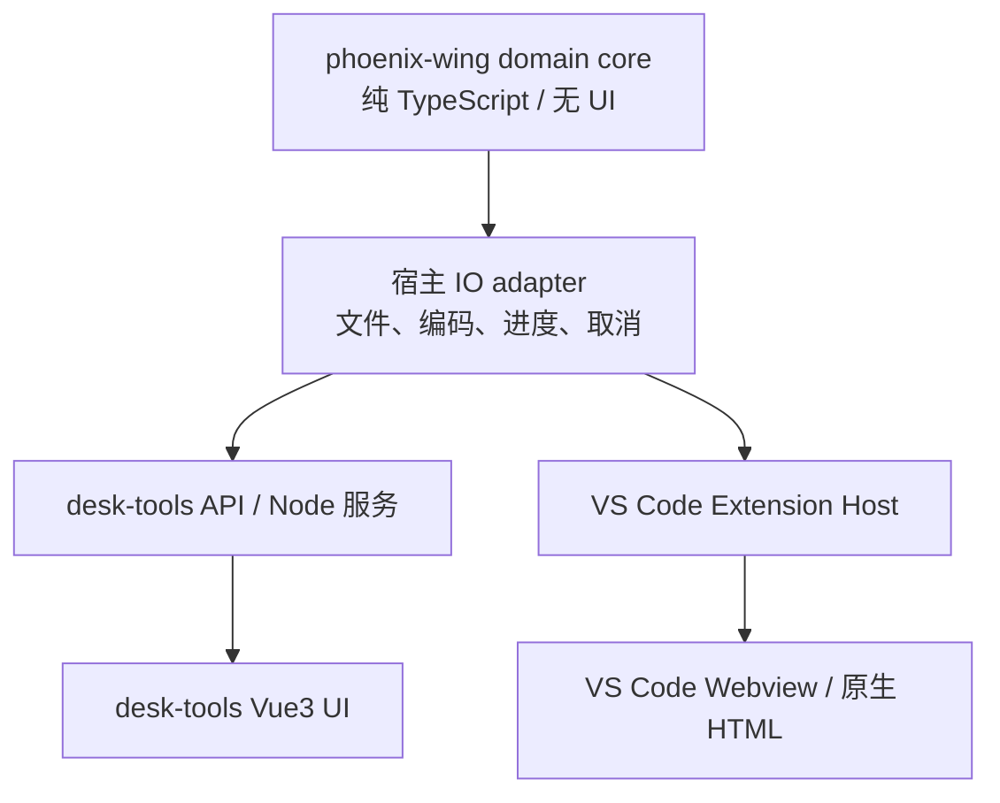

# phoenix-desk-tools 与 KT Auto Code 共享算法、双端 UI 适配计划

> 状态：历史路线记录；成员排序已迁入 `phoenix-wing/code-core`。算法语义、锁定规则与回归契约以 [phoenix-wing · C++成员排序算法规范](../../phoenix-wing/doc/C++成员排序算法规范.md) 为准，本文件不再维护规则副本。<br>
> 目标：函数排序、CAA 对话框等能力由一套无 UI 的核心代码提供给 `phoenix-desk-tools` 与 VS Code 插件；两端只保留宿主适配和界面代码。

## 0.1 当前迁移盘点（2026-07）

| 能力 | 当前结论 | phoenix-wing 归属 | 下一步 |
| --- | --- | --- | --- |
| C++ 成员排序 | 已共用 `code-core`；插件用原生底部结果 View，Desk 保留 Vue 页面 | `phoenix-wing/code-core` | 两端继续只修共享算法；结果 UI 不互相复制 |
| 文件结果分组/排序 | 已抽为无 VS Code/Vue 依赖的纯函数 | `phoenix-wing/code-core` | 搜索替换、编码修正、克隆等模块验证后复用 |
| UUID | Desk 已支持虚线/花括号 UUID、GUID32、CAA GUID、两种生成策略；插件当前 P0 只支持虚线 UUID 的“同值映射” | `code-core` 中的识别、归一化、格式保持与替换；宿主扫描/编码/写盘留在各端 | 先将 Desk UUID 的格式 parser 拆为纯函数并以 fixture 对齐，不能把 `pdtCodeService` 的 Node FS 直接搬入 Wing |
| CAA `.CATDlg` | Desk 的 `catdlg-core` 是唯一解析/emit/patch 实现；插件仅扫描、选择和交接 | 未来 `phoenix-wing/catdlg-core`，保留 browser 与 Node/VS Code adapter 边界 | 先迁纯 core 与 fixture；再实现 Desk bridge，禁止插件重写编辑器 |
| CAA/NLS “翻译” | 不是通用机器翻译模块，而是 `.CATNls` locale、key、补齐和写回流程 | 随 `catdlg-core` 迁移 | 不单独迁一份翻译 UI 或把 Vue NLS 编辑器放进 VSIX |

“其他能力都移过来”的执行规则：仅迁移纯算法、数据协议、校验和 fixture；Vue 页面、Node 文件服务、VS Code 命令和 Tauri 生命周期保留在各自宿主。这样 AI 读取本计划时可以按“核心 → adapter → UI”定位，不会误把 Desk 页面复制进插件。

## 0. 关联仓库位置

本项目默认与相关 Git 仓库放在同一个上一级目录下（不记录具体用户目录）：

```text
<phoenix-parent>/
├── kt-auto-code/          # 当前 VS Code 插件
├── phoenix-desk-tools/    # 桌面工具、函数排序、CAA Web 编辑器
└── phoenix-wing/          # 计划中的共享基础包/组件仓库
```

后续 AI 或脚本查找关联代码时，默认按以下路径寻找：

| 仓库 | 默认路径 | 本计划中的用途 |
| --- | --- | --- |
| 当前插件 | `<phoenix-parent>/kt-auto-code` | VS Code Host、Webview 和现有搜索替换核心 |
| phoenix-desk-tools | `<phoenix-parent>/phoenix-desk-tools` | 迁移后的 TS 引擎、Vue3 页面、CAA `catdlg-core` |
| phoenix-wing | `<phoenix-parent>/phoenix-wing` | 最终承载共享 `code-core`、`catdlg-core` 和公共类型 |

仓库内可使用这些相对链接跳转到关联资料：

- [phoenix-desk-tools：函数排序实现](../../phoenix-desk-tools/phoenix/code/reorder_members.py)
- [phoenix-desk-tools：函数排序规则](../../phoenix-desk-tools/doc/code/成员函数排序-reorder_members.md)
- [phoenix-desk-tools：CAA 核心包](../../phoenix-desk-tools/packages/catdlg-core)
- [phoenix-desk-tools：CAA 后期抽包规划](../../phoenix-desk-tools/doc/TODO-CAA.md#c5-后期封装)
- [phoenix-wing：共享仓库](../../phoenix-wing)

实际部署时只需将 `<phoenix-parent>` 替换为本机的 Phoenix 工作区根目录；不要把 `phoenix-desk-tools` 或 `phoenix-wing` 嵌套复制到 `kt-auto-code` 内。

## 1. 调查结论

### 1.1 C++ 函数排序

当前实现位于：

- 当前算法基线：`phoenix-desk-tools/server/src/lib/reorderCppEngine.ts`、`reorderHeaderEngine.ts`
- 当前服务封装：`phoenix-desk-tools/server/src/lib/reorderMembersService.ts`
- Python 遗留实现：`phoenix-desk-tools/phoenix/code/reorder_members.py`（仅用于历史参考/兼容，不再作为规范实现）
- Web 页面：`phoenix-desk-tools/web-ui/src/pages/ReorderMembersPage.vue`
- 页面状态与属性面板：`web-ui/src/stores/reorderMembersPage.ts`、`web-ui/src/composables/useReorderMembersPropertySheet.ts`
- 规则与回归资料：`phoenix-desk-tools/doc/code/成员函数排序-reorder_members.md`、`成员排序-锁定段与回归用例.md`

算法不是简单的字母排序，至少包含：

1. `.cpp` / `.h` 不同的成员提取规则和访问区处理。
2. 构造函数、析构函数、拷贝/移动构造、赋值运算符等特殊成员的固定顺序。
3. 普通成员的大小写不敏感排序、重载保持源文件顺序。
4. 注释、宏、初始化列表和空行随成员一起移动。
5. `clang-format off/on`、CAA Wizard、pragma 等锁定区域不参与排序。
6. 原文件编码检测、只在内容变化时写盘，以及 dry-run/忽略规则。

因此后续不应再围绕 Python 设计迁移方案。VSIX 默认应消费迁移后的 TypeScript/Rust 能力，不依赖用户安装 Python、特定虚拟环境或桌面工具的 HTTP 服务。

### 1.2 CAA 对话框

CAA 的核心已经比函数排序更适合共享：

- 核心包：`phoenix-desk-tools/packages/catdlg-core/`
- 解析、IR、emit、patch、merge、Wizard 同步、控件 catalog 都是 TypeScript。
- Node 专用文件已经通过 `./node` 入口与浏览器安全入口分离。
- Web UI 仍是 Vue 3，主要页面和组件位于 `web-ui/src/pages/CaaDialogEditorPage.vue`、`web-ui/src/components/caa/`。
- 现有 CAA 规划已明确“后期 `catdlg-core + io-adapter` 抽离，供 VS Code 扩展 POC”。

**结论：**函数排序需要一次跨语言迁移；CAA 核心已经具备共享基础，应优先抽包，而不是重写 CAA 算法。

## 2. 总体架构建议

### 2.1 phoenix-wing 放什么

可以放入 phoenix-wing，但应放“领域核心包”，不要把桌面页面或 VS Code API 放进去。建议在 phoenix-wing 中新增或正式化以下包（具体包名待 phoenix-wing 仓库确认）：

```text
phoenix-wing/
  packages/
    code-core/              # C++ 解析、成员排序、变更计划
    catdlg-core/            # CAA IR、解析、写回、校验（由现有包迁入）
    file-core/              # 可选：编码检测、文本读写、忽略规则抽象
```

如果 phoenix-wing 当前发布机制只提供一个 `phoenix-wing` 包，也可先使用子路径导出：

```text
phoenix-wing/code/reorder
phoenix-wing/catdlg
phoenix-wing/file
```

不建议把 `reorder_members.py` 原样放进 npm 包。根据 phoenix-desk-tools `master` 的迁移结果，当前应以 `server/src/lib/reorderCppEngine.ts` 与 `reorderHeaderEngine.ts` 为行为基线，将这套已通过差分测试的 TypeScript 引擎抽到共享包；Python 文件只保留为历史参考或尚未清理的兼容入口。若某个子能力在 phoenix-wing 已经有 Rust 实现，则由共享包提供稳定的 TS facade，必要时再调用 Rust，不在两个产品中各写一套规则。

### 2.2 分层边界



核心层只接受字符串、IR、选项和抽象的诊断结果；不导入 Vue、Element Plus、`vscode`、FastAPI、Node `fs`。这样才能被浏览器测试、Node 服务和 VS Code Extension Host 同时使用。

### 2.3 phoenix-wing 是否应去除 Vue

**应去除 Vue 依赖，但不是一次性删除所有 Vue3 页面。** 更合适的是把 phoenix-wing 分成三层：

```text
phoenix-wing/
  core/                 # 纯算法、IR、命令、校验、类型；无 DOM / Vue
  ui-headless/          # 无框架状态机、键盘交互、可访问性、设计 token
  ui-vue/               # Vue3 包装组件，供 desk-tools/Tauri 继续使用
```

推荐顺序：

1. `code-core`、`catdlg-core` 和任务协议先保持纯 TypeScript；这是真正必须跨 VS Code、Tauri 和服务端复用的部分。
2. 把简单、稳定、跨宿主的控件抽成 headless 能力，例如折叠 Block、结果列表、诊断摘要、确认状态机、文件选择模型；Vue3 只负责渲染包装。
3. VS Code 侧用原生 HTML/CSS 或轻量 Webview 渲染这些 headless 状态，不引入 Element Plus。
4. CAA 画布、控件属性面板、拖拽布局、多 Tab 等复杂组件先保留 Vue3，继续由 Tauri desk-tools 承担。

不建议现在把所有 phoenix-wing Vue 组件改成 Web Components：

- Web Components 能跨宿主，但复杂表单和画布的状态、主题、拖拽、测试成本会明显增加。
- Vue3 仍是 Tauri desk-tools 当前成熟的实现，重写不会直接提高排序/CAA core 的复用率。
- VS Code 真正需要的是轻量入口和结果查看，不需要复制完整 CAA UI。

因此目标不是“phoenix-wing 完全没有 Vue”，而是“核心和跨宿主控件不依赖 Vue；Vue3 只作为 desk-tools/Tauri 的渲染适配层”。

## 3. 函数排序迁移计划

### 3.1 目标 API（草案）

```ts
export interface ReorderOptions {
  language: "cpp" | "header";
  preserveLockedRegions: boolean;
  sortMembers: "special-then-name";
  memberVariables: "preserve" | "name";
}

export interface ReorderInput {
  uri: string;
  text: string;
  encoding: "utf8" | "utf8-bom" | "ascii" | "gbk" | "unknown";
}

export interface ReorderResult {
  changed: boolean;
  text: string;
  diagnostics: Diagnostic[];
  lockedRanges: TextRange[];
  diff?: TextEdit[];
}

export function reorderMembers(
  input: ReorderInput,
  options: ReorderOptions,
): ReorderResult;
```

核心函数只做解析、排序、重建文本和诊断；逐文件遍历、Ignore、确认写盘、进度和取消由宿主负责。

### 3.2 分阶段迁移

| 阶段 | 内容 | 验收 |
| --- | --- | --- |
| R0 现状确认 | 以 `phoenix-desk-tools/master` 的 TS 引擎、界面和测试为基线；检查 Rust 分支/包是否已承载相关子能力；标记 Python 遗留入口 | 明确每个能力的真实实现位置，不把旧 Python 文档当成现状 |
| R1 共享接口 | 从现有 TS 引擎抽出成员块、访问区、锁定区、编码和诊断接口，不先改变排序行为 | desk-tools 现有 15 个 header、7 个 cpp fixture 仍保持等价输出 |
| R2 phoenix-wing 接入 | 将引擎及必要 codec/fixture 移入 phoenix-wing 公共包；desk-tools 改为依赖该包 | 一条规则修复只修改共享 core，desk-tools UI/API 行为不变 |
| R3 VS Code 接入 | Extension Host 调用共享 core，负责工作区扫描、Ignore、编码、预览和写盘；Webview 只展示结果 | VSIX 离线安装后不需要 Python 或 desk-tools 服务 |
| R4 遗留清理 | 确认没有生产调用后，再删除或降级 Python 入口和过时文档；保留迁移说明 | CI 与两端只维护共享 core 的 golden/契约测试 |

### 3.3 为什么不直接让 VS Code 调 Python

历史上直接调用 Python 会带来这些问题，因此不作为新插件方案：

- 用户安装 VSIX 后不一定有 Python 或正确依赖。
- Windows、macOS、Linux 的 Python 路径和编码环境不同。
- 进程启动、取消、错误映射和打包会增加发布风险。
- Python 遗留 parser 与已经迁移的 TypeScript parser 可能产生不一致。

如果 phoenix-wing 的包发布尚未完成，可暂时从 phoenix-desk-tools 的已迁移 TS 引擎建立只读依赖或 Node CLI；这只是包搬迁过渡，不能重新引入 Python，也不能复制算法。

## 4. CAA 对话框共享计划

### 4.1 先抽核心，不搬整套 Vue 页面

第一步把 `packages/catdlg-core` 从 `@desk-tools/catdlg-core` 改成 phoenix-wing 可消费的公共包（包名和仓库位置可在发布前确定），保留：

- `.CATDlg` / `.CATNls` / `.CATRsc` 解析与 emit。
- IR schema、校验、Grid/父子关系和控件 catalog。
- `.h` / `.cpp` Wizard 标记段 patch。
- merge、dry-run、warning/error 和 golden fixtures。

拆出或新增 `io-adapter`：

```ts
export interface CaaFileAdapter {
  read(uri: string): Promise<{ bytes: Uint8Array; encoding: string }>;
  write(uri: string, bytes: Uint8Array): Promise<void>;
  exists(uri: string): Promise<boolean>;
}
```

桌面端用 Node 文件系统实现，VS Code 用 `vscode.workspace.fs` 实现；浏览器预览只使用内存 adapter。核心默认入口继续保持浏览器安全，Node 文件能力只从 `./node` 或 adapter 注入。

### 4.2 CAA 两端 UI 的取舍

不建议现在“去掉 Vue3”或把几十个 CAA Vue 组件直接塞进 VS Code Webview：

- desk-tools 的 Vue3 页面已经包含画布、控件面板、NLS、相关文件、撤销/重做等完整工作流。
- VS Code Webview 的空间、主题、快捷键和文件交互不同，直接复用 Element Plus 组件会带来包体和交互问题。
- 真正应共享的是 IR、命令、校验、预览 diff、保存协议和测试 fixture，而不是 DOM 组件。

建议：

1. desk-tools 继续保留 Vue3，逐步把 Vue composable 中的纯状态机、校验和转换函数移到 core。
2. **VS Code 不嵌入 CAA Vue3 编辑器**，只实现搜索 `.CATDlg`、选择文件、查看基础信息/diff、启动 Tauri 和接收结果。
3. 大型画布、控件拖动、属性编辑、NLS、相关文件、多 Tab 和撤销/重做全部由 Tauri desk-tools 承担。
4. 两端共用 `CaaCommand`、`CaaEditorState`、`CaaDiagnostic` 和任务协议类型；不要求共享 Vue/Element Plus 组件。
5. 暂不引入 Web Components。只有未来出现第三种非 Vue 宿主且确实需要同一套控件时，再单独评估。

这会让 VSIX 保持“轻客户端”定位：不打包 Vue3、Element Plus、CAA 画布和大型编辑器依赖，只保留搜索、上下文收集、Tauri 启动器、diff 查看和结果刷新能力。

### 4.3 CAA 分阶段交付

| 阶段 | 交付 | 说明 |
| --- | --- | --- |
| C0 | 公共包与版本策略 | `catdlg-core` 无 Vue/Node 隐式依赖，导出 browser/node 入口 |
| C1 | VS Code 入口 + Tauri 只读查看 | VS Code 搜索/选择 `.CATDlg` 后调起 Tauri；Tauri 解析 IR 并显示树和基础 Grid |
| C2 | Tauri 预览与安全写回 | 在 Tauri 中显示 `.CATDlg/.CATNls/.h/.cpp` diff，确认后通过 adapter 写回；不修改 marker 外代码 |
| C3 | 基础编辑 | 控件属性、Grid、NLS 文本、撤销/重做；复用 core 的 patch/validate |
| C4 | Tauri 高级画布 | 拖放、伸缩、相关文件、catalog 补全；只有验证确有需求才实现 |

## 5. VS Code 侧建议 UI（先小后大）

函数排序可以先采用与现有搜索替换一致的“侧栏设置 + editor-area 预览”模式：

```text
┌ KT Auto Code · C++ 工具 ───────────────┐
│ 函数排序                              ▾ │
│ [选择文件/目录] [保留锁定区 ✓]           │
│ [扫描]                                  │
└────────────────────────────────────────┘

编辑区：C++ 成员排序预览
┌────────────────────────────────────────┐
│ ☑ file.cpp   12 项变更   [查看 diff]    │
│ ☐ file.h      无变化                    │
│ ⚠ locked.cpp 解析警告                  │
│                         [应用] [取消]   │
└────────────────────────────────────────┘
```

VS Code 侧只需：

```text
侧栏：搜索/选择 CATDlg → 在 desk-tools 打开
编辑区：文件信息、只读摘要、外部编辑器状态、diff
操作：打开 Tauri、重新扫描、查看变更、重新加载
```

复杂的控件属性表、拖拽画布和多 Tab 留在 desk-tools。VS Code 不复制一份 CAA 编辑器，只作为轻量入口和结果查看器。

### 5.1 VS Code 调起 Tauri desk-tools 进行对话框移动

**可行，而且比把完整 CAA 画布塞进 VS Code Webview 更合适。** 推荐把 Tauri desk-tools 定位为可选的 CAA 高级编辑器 companion app：VS Code 负责文件选择、命令入口和轻量预览；Tauri 负责大画布、拖拽移动、控件属性和复杂多 Tab。

建议交互：

```text
VS Code 命令：在 desk-tools 中移动 CAA 对话框
        │
        ├─ 启动或激活 Tauri desk-tools
        ├─ 传递 workspaceRoot + CATDlg/CATNls 文件 + 会话 ID
        ▼
Tauri CAA 编辑器：解析 IR → 拖动控件 → 校验 → 生成 diff
        │
        ├─ 用户确认后由共享 core 写回
        └─ 返回 sessionId、变更文件、版本/指纹、诊断
        ▼
VS Code：刷新文档、显示 diff/警告、提示重新加载
```

#### 交接方式（按优先级）

1. **命令行参数 + 本地回调**：VS Code 启动 Tauri 可执行文件，传入一次性 JSON 任务文件；Tauri 完成后通过本地 HTTP/Unix socket 或结果 JSON 回传。实现简单，适合首版。
2. **自定义 URI 协议**：注册 `phoenix://caa/edit?...`，用于激活已安装的 Tauri 应用；URI 只传短 ID，实际内容放在受保护的任务文件中，避免路径和中文参数转义问题。
3. **本地 IPC 服务**：Tauri 常驻时由 VS Code 发送 `openSession`、`preview`、`apply`、`cancel` 消息；适合连续编辑，但需要端口/进程生命周期管理。

首版建议采用 1，后续再增加 2/3。不要让 VS Code 直接控制 Tauri 的 DOM，也不要让 Tauri 依赖 VS Code API；两端通过稳定的任务协议和共享 `catdlg-core` 协作。

#### 本地端口与内置浏览器的备选方案

如果 Tauri 启动时同时启动本地 HTTP 服务，也可以采用以下模式：

```text
Tauri 启动
  ├─ 启动本地 CAA 服务（随机 localhost 端口）
  ├─ 健康检查 /health，取得 session token
  └─ Tauri WebView 打开 http://127.0.0.1:<port>/caa/edit/<session>
```

这种方式意味着“CAA 页面是一个本地 Web 应用”，但不意味着只要 Tauri 进程存在端口就一定可用。VS Code 必须调用带 token 的 `/health` 或 `/session` 握手接口，确认服务已就绪、版本兼容且对应工作区正确。

推荐优先级：

1. **首选：Tauri 自己打开内置 WebView**。页面、端口和窗口生命周期由 Tauri 管理，拖动体验最好，也不依赖 VS Code 的浏览器实现。
2. **可选：VS Code 打开本地地址查看**。适合只读摘要或 diff；可使用外部浏览器或 VS Code Simple Browser，但不同 VS Code 版本对内部浏览器命令支持不稳定，不应作为唯一入口。
3. **不建议：VS Code Webview 直接 iframe Tauri localhost 页面**。会遇到 CSP、端口授权、跨窗口通信、主题和生命周期问题，而且仍然把大型 Vue 页面带入 VS Code 侧的交互链。

端口方案的安全要求：随机端口、一次性 session token、只监听 loopback、超时自动关闭、校验 workspace/file fingerprint；服务未就绪或 token 失效时，VS Code 显示启动失败而不是盲目打开空白页面。

#### 必须明确的安全与一致性规则

- 只允许打开当前工作区或用户明确授权的文件，任务协议拒绝路径穿越和未授权目录。
- 传递 `workspaceRoot`、相对路径、文件指纹（mtime/size/hash）和 core 版本；Tauri 写回前再次校验指纹，文件已被 VS Code 或其他程序修改时停止并要求重新加载。
- 写回仍走 `catdlg-core` 的 patch/validate/diff；Wizard marker 外代码不得修改。
- 用户可以在 Tauri 中预览和取消；只有明确确认才写盘。VS Code 只刷新和展示结果，不重复执行第二次写盘。
- Tauri 未安装或启动失败时，VS Code 降级为只读预览，并给出安装/路径配置提示，不影响普通搜索替换功能。

#### 适用范围

| 能力 | VS Code Webview | Tauri companion |
| --- | --- | --- |
| 选择文件、解析状态、diff | 首选 | 可同步显示 |
| 简单属性编辑 | P0/P1 可做 | 可做 |
| 大型 Grid 画布、拖动、缩放 | 不建议首版实现 | 首选 |
| 多对话框、多 Tab、相关文件联动 | 先只读/跳转 | 首选 |
| 最终写回 | 由共享 core 完成 | 由共享 core 完成 |

这个方案不要求删除 Vue3。desk-tools 继续使用 Vue3/Tauri；VS Code 只增加启动器和结果适配层，公共部分仍是 `catdlg-core`、任务协议、诊断和测试 fixture。

## 6. 版本、测试与发布

### 6.1 版本策略

- core 使用独立 semver；规则改变或输出变化必须升 minor/major，并记录迁移说明。
- desk-tools 和 KT Auto Code 锁定兼容的 core 版本，不使用浮动 `latest`。
- VSIX 打包时把纯 TS core 打入扩展，不要求用户安装桌面工具。

### 6.2 必备测试

- 函数排序：以迁移后的 TS/Rust 输出为 golden，覆盖锁定区字节比较、注释/宏/重载/特殊成员和 UTF-8/GBK 编码；Python 只作为历史差异资料，不作为持续测试依赖。
- CAA：现有 `catdlg-core` Vitest、`.CATDlg/.CATNls` golden、非法 Grid/重复 ID、Wizard marker 外保护。
- 双端契约：同一个输入在 desk-tools API 和 VS Code Host 返回相同 IR、诊断和 diff。
- UI：只测命令状态、确认/取消、错误显示；不要求两个宿主共享像素级快照。

### 6.3 成功标准

1. 一条算法修复只需修改 phoenix-wing core 一处。
2. desk-tools 与 VS Code 对同一 fixture 产生相同结果。
3. 没有把 Vue、Element Plus 或 `vscode` 依赖带入 core。
4. Python 遗留文件不会成为 VSIX 或新服务的运行时依赖；CAA 写回始终保留 marker 外代码。
5. VSIX 离线安装后，函数排序和 CAA P0 不依赖本机 Python 服务。

## 7. 推荐决策

| 问题 | 建议 |
| --- | --- |
| 是否放到 phoenix-wing？ | **是**，放无 UI 的 `code-core` 与 `catdlg-core`；不要放页面和宿主 API。 |
| 是否一套代码？ | **是**，以迁移后的 TypeScript/Rust core 为规范实现；Python 仅作遗留兼容参考。 |
| 是否删除 Vue3？ | **暂不删除**。desk-tools 保留 Vue3；VS Code 不嵌入 Vue3 CAA 页面。 |
| VS Code 是否嵌入 Vue3 CAA 页面？ | **不嵌入**。VS Code 只做搜索、上下文、diff 和 Tauri 启动；Vue3 CAA 页面留在 Tauri。 |
| VS Code 是否可以调用 Tauri 移动对话框？ | **可以**。采用 companion app + 任务协议；Tauri 负责复杂画布，VS Code 负责入口、文件上下文和结果回传。 |
| 函数排序优先级？ | 高。它是 KT Auto Code 的直接功能，但需先做 golden 和 TS 迁移。 |
| CAA 是否一次搬完？ | 否。先复用已有 `catdlg-core`，VS Code 从只读预览和 diff 开始。 |

## 8. 下一步（仍不实现业务代码）

- [ ] 确认 phoenix-wing 仓库的 monorepo、发布包名和 Node 版本支持范围。
- [ ] 以 `server/src/lib/reorderCppEngine.ts`、`reorderHeaderEngine.ts` 和现有 master 测试整理共享 core 的 R0 golden 清单，并标记 Python 遗留入口。
- [ ] 为 `catdlg-core` 设计迁移后的 package exports 和 `io-adapter` 接口。
- [ ] 画出 desk-tools API 与 VS Code Host 的命令契约，确定错误码、取消和进度字段。
- [ ] 先做函数排序 TS core POC，再决定是否开始 CAA VS Code P0。
