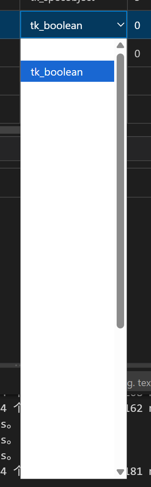

# Combo 下拉列表多主题配色问题（含浅色）

> **状态：本地 Wing 源码已修正；Mac 定向自动回归通过，Windows 实机待测。**
>
## 当前分支核对（2026-09-10）

- 对应用户已反馈的自动代码 Right 参数表原生下拉：Windows 多个色系下白底白字，hover 后才可见，**包括浅色主题，不限于截图中的深色主题**；用户目前仅确认 Light Modern 正常，不能推断其他浅色主题正常。Mac 未见同样问题，具体失败主题名仍待补齐。
- 实现是 Wing `packages/kt-codegen/src/table/KtCodegenTable.ts` 创建的原生 `select/option`，不是已迁入 Wing 的 PnwCombo。
- 本地 Wing `packages/kt-codegen/src/table/KtCodegenTableStyle.ts` 已为 `td > select > option` 成对设置 `--vscode-dropdown-foreground/background`，逐级回退到 input/editor/system 颜色，避免继承选中表格行的白字；强制配色使用 `CanvasText/Canvas`，保留未知值的警告色。
- 2026-09-10 在 Mac 重跑 `pnpm exec vitest run tests/table-style.test.ts`：**7/7 通过**。这只验证样式契约，不等于 Windows 原生弹出列表已验收。
- 此修正仍是本地 Wing 未提交增量，未进入此前冻结的 `0.9.2` VSIX，也未作为 Registry 发布；不能据当前源码判断旧安装包已有修复。
- 只改 UI，不改变生成内容，`@codegen-rules-version` 保持 `1.0.1`。后续 Mac 工作继续推进，Windows 实测单列，不阻塞 Mac 开发。

## 问题现象

Windows 下多个色系（包括浅色）均出现下拉选项文字不可读的问题，hover 到对应行后才可见。下图只展示其中一个深色主题实例，不代表问题仅限深色，也不只是深色界面与白色背景风格不一致。

截图中的具体表现：展开当前值为 `tk_boolean` 的 Combo 后，下拉列表显示大面积白色背景。

- 收起区域为深蓝色背景、白色文字。
- 展开的列表为白色背景，选中项为蓝底白字，滚动条为灰色。
- 深色界面与白色弹出列表之间反差明显，视觉风格不统一。

截图还显示列表高度较大、存在大量空白和纵向滚动条。作为附带现象保留，是否与配色问题同源待确认；不能仅凭截图判断空白处是否存在不可见选项。

## 问题截图

## 复现线索

1. 在 Windows 的自动代码 Right JSON 参数表中，分别切换多个色系（包括浅色和深色），打开包含 Combo 的表格；不要只测试截图对应的深色主题。
2. 展开当前值为 `tk_boolean` 的下拉框。
3. 在鼠标尚未移入选项行时检查文字是否可读，再对比 hover 后的显示；同时观察背景、选中状态和滚动条是否与当前主题协调。

页面入口为自动代码 Right JSON 参数表；具体失败主题名称及完整选项数据待补充。实测时必须包含普通项、选中项、hover 项以及切换主题后的再次展开。

## 预期表现

Combo 展开后的列表应适配当前主题，背景、文字及选中状态清晰可辨，并与所在界面保持一致。切换配色后不应残留不匹配的固定颜色。

## 验收清单

- [ ] 多个深色主题下，下拉列表背景与文字配色协调，普通项和选中项均清晰可读，无需 hover 才能辨认文字。
- [ ] 多个浅色主题下，下拉列表同样清晰可读；除 Light Modern 外，必须覆盖用户报告有问题的浅色主题。
- [ ] 逐项记录 Windows 实测主题名称和结果，不以单个深色或 Light Modern 通过代表整个色系通过。
- [ ] 切换主题后，Combo 收起区域和展开列表均使用对应配色。
- [ ] 排查截图中的大面积空白，确认不存在文字与背景同色导致选项不可见的问题。

本记录不涉及 [CAA Combo 通知生成](自动代码-CAA-combo的信号问题.md) 或 [Combo 参数回填缺少字段注释](自动代码-Combo参数回填缺少注释行.md)。后者仍需单独处理，不能随配色修正一并标记完成。
